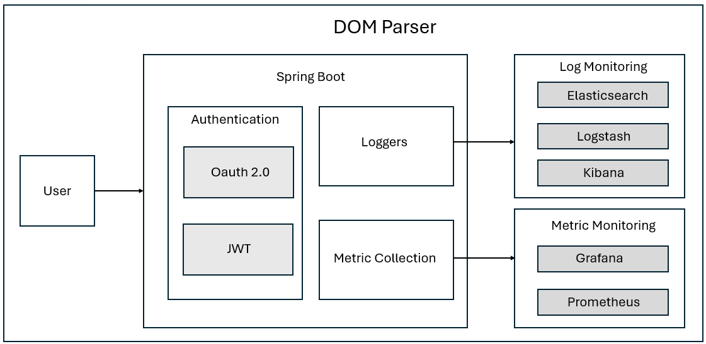

## dom-parser
A simple implementation of a dom parser.

A DOM parser is a tool that takes up the HTML or XML as the input and converts into tree like objects that make it faster to access and manipulate.

Dom Parsers are used in various use cases:
- Web Browser: This is primary use case of the DOM Parser where the HTML content is divided into the DOM tree where each node represents the part of the HTML document.
- Web Development: The DOM tree is manipulated using the Javascript dom-manipulation methods
- Web Scraping Tools: The web scraping tools uses the DOM parser to navigate through the html files to pick the value or content from the particular nodes.
- Testing Frameworks: Testing tools like Selenium and Puppeteer use dom parsing to interact with the web pages for automated testing
- XML Processing applications: Applications that parses, and beautifies XML files use a similar implementation of the DOM Parser.

A simple architecture of our implementation can be found below: 

In our implementation, we will be working on a dom parser implementation that parses through both XML and HTML files.

Technologies Used:
The motive of the project is to get in use with the Spring Boot (multiple authentications, logger) and some integrations to process the logs and metrics. 
The primary spring boot libraries used for the project are:
- Spring Boot Starter Web
- Spring Security (Oauth and JWT)
- Logger Integrations (Logback)

We have used the ELK (Elasticsearch, Logstash, and Kibana) Stack to integrate with the generated logs.

We have used Prometheus and Grafana to integrate with metrics.
